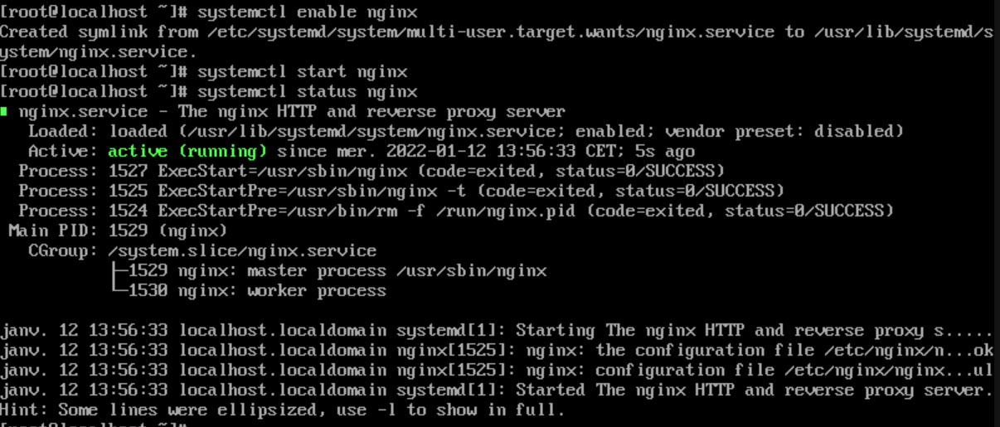

# M1-Ydays

## Configuration DHCP

```bash
$ yum install dhcp
$ systemctl enable dhcpd
$ vim /etc/dhcpd/dchpd.conf

default-lease-time 600;
max-lease-time 7200;

authoritative;
log-facility local7;

subnet 10.2.20.0 netmask 255.255.255.0 {

}

# VLAN 30 - Users
subnet 10.2.30.0 netmask 255.255.255.0 {
        range 10.2.30.100 10.2.30.150;

        option domain-name "ydaynetwork.lab";
        option domaine-name-servers 10.2.10.11;
}

:wq!

$ systemctl start dhcpd
$ systemctl status dhcpd
```

## Configuration DNS

```bash
$ yum install bind bind-utils -y
```

## Configuration Serveur Web

### Installer Ngninx  

``` bash
$ sudo yum install epel-release
$ sudo yum install nginx 
$ systemctl enable nginx
$ systemctl start nginx
$ systemctl status nginx
```


### Installer PHP
```
sudo apt install php-fpm
```
Activer PHP dans Nginx
```
cd /etc/nginx
sudo nano sites-enabled/default
```
toruver la ligne `index index.html index.htm;`
Ajouter `index.php`  après `index` pour ressembler à ceci:
```
index index.php index.html index.htm;
```


## Héberger son site sur le server
Nginx préinstalle une page index.html qui se trouve dans : `cd / var / www /`  
pour ouvrir le fichier : 
```
sudo nano index.html
```